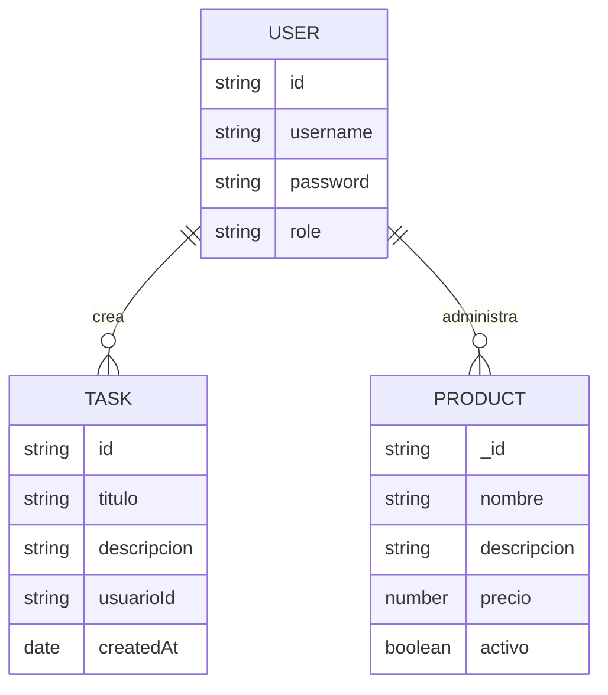

# Documentación del Proyecto

## 1) Requerimientos funcionales

1. Registrar usuarios con contraseña cifrada.
2. Iniciar sesión y devolver JWT.
3. Restringir acceso a rutas de tareas y productos mediante middleware JWT.
4. Permitir CRUD de tareas almacenadas en `tareas.json`.
5. Permitir CRUD de productos en MongoDB mediante Mongoose.
6. Exponer una vista estática (`login.html`) para autenticarse.
7. Devolver respuestas HTTP correctas (200, 201, 400, 401, 403, 404, 500).

## 2) Requerimientos no funcionales

1. Seguridad básica mediante hashing con bcrypt y tokens JWT con expiración.
2. Operaciones de archivos asíncronas con `fs.promises` para no bloquear el Event Loop.
3. Código modular con separación por rutas, controladores, modelos y middlewares.
4. Pruebas automatizadas con Jest/Supertest.
5. Integración continua mediante GitHub Actions.

## 3) Diagrama entidad-relación (alto nivel)

## 4) Justificación de SaaS para despliegue

Se recomienda **Render** o **Railway** para esta API porque soportan Node.js de forma nativa, variables de entorno, integración con GitHub y despliegues automáticos por rama. Además, simplifican la exposición del servicio HTTP y el uso de MongoDB Atlas como base de datos administrada.

## 5) Evidencia de uso de IA

Se puede usar Copilot/ChatGPT para generar borradores de pruebas (`tests/*.test.js`) y posteriormente ajustar manualmente:
- rutas protegidas con JWT,
- validaciones de payload,
- y códigos HTTP esperados.

